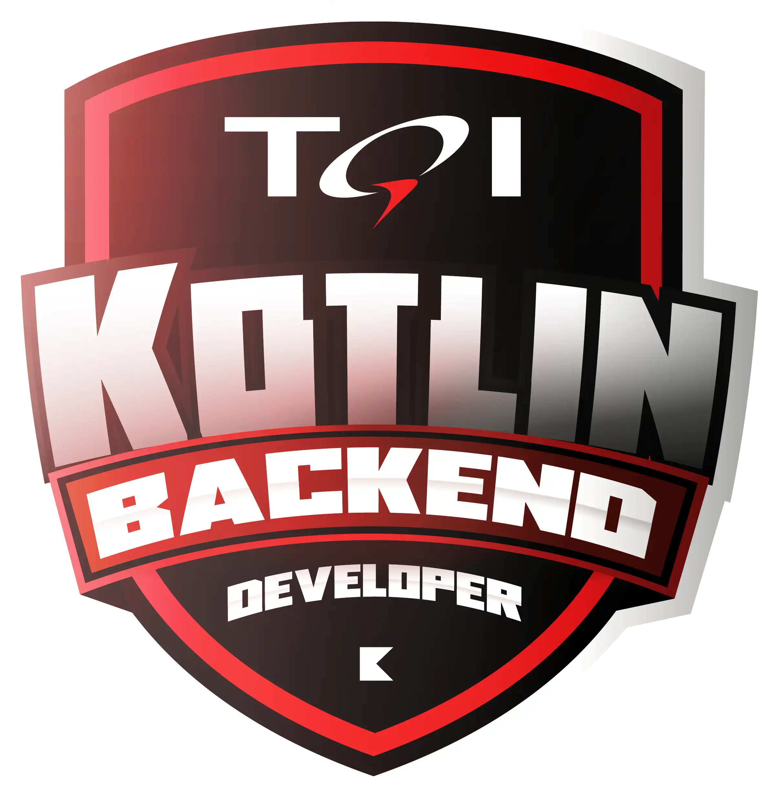

# Bootcamp-TQI-Kotlin-Backend-Developer

- 38 cursos.
- 6 desafios de projeto.
- 10 desafios de código.
- 1 live.
- 7 Mentorias.
- Datas: 16/03 a 21/05/23
- Carga Horária 112h.

O Bootcamp TQI Kotlin - Backend Developer é um programa para formação de profissionais que estão iniciando sua carreira e buscam mais conhecimento técnico em desenvolvimento back-end. E, para qualquer pessoa que queira aprender, evoluir e se tornar um profissional de tecnologia. O programa conta com mais de 100 horas de experiências educacionais, incluindo atividades didáticas e, também, desafios práticos para que você tenha o aprendizado completo. Além disso, para tornar sua jornada ainda mais completa, você terá a oportunidade de assistir mentorias ao vivo com os(as) experts da TQI! Os melhores classificados no Bootcamp serão selecionados para seguir nas fases seguintes do processo seletivo de contratação.
